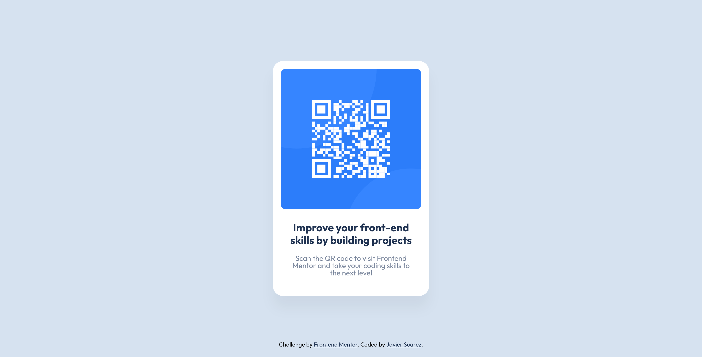

# Frontend Mentor - QR code component solution

This is a solution to the [QR code component challenge on Frontend Mentor](https://www.frontendmentor.io/challenges/qr-code-component-iux_sIO_H). Frontend Mentor challenges help you improve your coding skills by building realistic projects.

## Table of contents

- [Frontend Mentor - QR code component solution](#frontend-mentor---qr-code-component-solution)
  - [Table of contents](#table-of-contents)
  - [Overview](#overview)
    - [Challenge](#challenge)
    - [Screenshot](#screenshot)
    - [Links](#links)
  - [My process](#my-process)
    - [Built with](#built-with)
  - [Author](#author)

## Overview

### Challenge

QR Component should respond to different screen sizes

### Screenshot

### Links

- Solution URL: [Link](https://github.com/suarez8924/fe-mentor-qr-code-component/tree/main)
- Live Site URL: [Live Site](https://fe-mentor-qr-code-component.netlify.app/)

## My process

### Built with

- Semantic HTML5 markup
- SASS
- Mobile-first workflow

## Author

- Frontend Mentor - [@suarez8924](https://www.frontendmentor.io/profile/suarez8924)
- GitHub - [@suarez8924](https://github.com/suarez8924)
